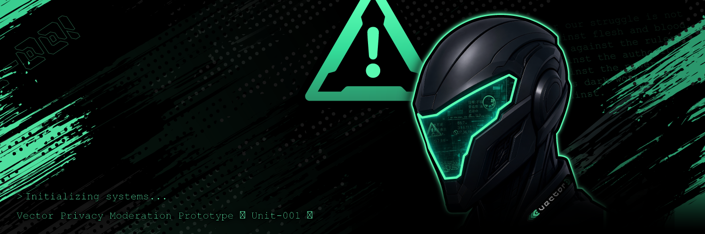

<div align="center">



# Sentire
***sentīre** (Latin, /senˈtiː.re/) — to perceive, to notice, to understand. The root of **sentinel** and **sentient**.*

[](LICENSE)
[](Cargo.toml)
[](#testing)

---

## Community Moderation Bot
**Sentire-001 is a full-time guardian for your Community.** Always vigilant, never off duty. A dedicated moderation bot for Vector Communities, built for the rooms that have outgrown what a handful of volunteers can watch by hand. Sentire-001 screens text as it lands, judges media through a vision model you choose, contains raids before they spread, and keeps one legible score per member. 

*It works the same at three in the morning as it does at noon, and it never gets tired of the same troll trying again.*

Moderation on most platforms means trusting someone else's rules, someone else's model, and someone else's servers. Sentire runs on yours. You set the policy, you pick the vision model, and every action it takes is a signed Concord event any member can verify. Nothing about your Community leaves it.

---


<h3 align="left">Raid Protection</h3>

<p align="left">Sentire watches the shape of activity, not just its content: a burst of fresh accounts joining together, near-identical messages arriving from different members, or a sudden spike in link posts all read as one coordinated event rather than a dozen unrelated ones. When it sees one, it acts on the whole wave at once, clearing a raid in a single batched moderation pass instead of racing it one ban at a time.</p>

---


<h3 align="left">Reputation System</h3>

<p align="left">Every member carries a single score that moves with their behaviour: helpful participation lifts it, deleted messages and warnings pull it down, and the number is visible rather than buried in a black box. Moderators can see why a score sits where it does before they act on it, so a decision rests on a member's history rather than on whichever message happened to be the last one read.</p>

---


<h3 align="left">Chat & Media Moderation (Explicit Material)</h3>

<p align="left">Text is screened as it lands, and images and video are passed to a vision model you choose, so the line between acceptable and not is set by your Community rather than by a policy written somewhere else. Anything that crosses it is removed before the room sees it, with the match logged so a moderator can review the call and adjust the threshold. Nobody has to look at what got caught in order for it to be caught.</p>

---

</div>


## Four lanes, one score

| Lane | Clock | Judges | Cost |
|---|---|---|---|
| **Screen** | every message, on arrival | words, links, regex, mention spam | local compute |
| **Sweep** | every `poll_secs` | rate, repetition, cohorts, join bursts | local compute |
| **Media** | every attachment and linked image | a vision model you choose | one inference |
| **Raid** | a tripwire, then a full evaluation | many distinct accounts at once | local compute |

The split is deliberate. A word filter that answers on the next tick is not a word filter,
and a rate limit has nothing to measure inside one message. Both paths run the same engine
over the same policies, so a verdict reached live is the verdict the sweep would reach later,
and both feed one ladder. A member escalates once, not twice.

## Convicts, then sentences

```
vector-core engine  ──convicts──▶  Sentire  ──sentences──▶  warn · delete · kick · ban · contain
   which rule matched,             the ladder                only what it has permission for
   how grave, what it cited
```

The engine reports "this member matched this rule, here is the proof", and stops. Sentire
decides what that is worth.

## Permission is the only switch

Sentire is always armed. What changes per community is what it has been granted.

| Granted | Behaviour |
|---|---|
| nothing | watches, judges, reports. Every verdict logged and DM'd to subscribers. |
| `MANAGE_MESSAGES` | also deletes what it convicts |
| `KICK` / `BAN` | also carries out the ladder, and contains raids |

Invite it, grant a role, and it begins. Revoke the role and it goes back to watching. One
switch, in one place.

## Quick start

```sh
cp sentinel.example.toml sentinel.toml
SENTINEL_NSEC=nsec1… cargo run --release -- sentinel.toml
```

The database lands beside the config (`sentinel.toml` → `sentinel.db`). A missing config is
the defaults: standard ladder, no custom rules, no media lane.

```toml
[bot]
nsec_env    = "SENTINEL_NSEC"
communities = ["*"]        # every community it is a member of
poll_secs   = 90
```

## Scoring

One number per member, small enough to say out loud.

| Offence | Adds |
|---|---|
| note / minor | **1** |
| serious | **2** |
| grave | **3** |

Strikes **halve every week**, so someone who stops falls back down. Actions sit at totals:

```toml
[ladder]
decay_half_life_hours = 168
steps = [
    { at = 1,  response = "warn" },
    { at = 9,  response = "kick" },
    { at = 12, response = "ban"  },
]
```

Default rungs give a grave offender two warnings, then a kick, then a ban.

Sentire climbs per offence, not per pass, and skips a rung it has no permission for
rather than stalling beneath it. An unarmed rung is rehearsed and recorded, so the ladder
keeps climbing past it.

## Rules

```toml
[rules]
window_hours    = 168
window_messages = 4000
raid_detection  = true

[[rules.words]]
id       = "slurs"
patterns = ["badword", "*wildcards*"]
gravity  = "grave"

[[rules.links]]
id      = "shorteners"
domains = ["bit.ly", "tinyurl.com"]
gravity = "serious"

[rules.rate]
enabled  = true
per_secs = 60
messages = 10
gravity  = "minor"

[rules.repetition]
enabled = true
times   = 4
gravity = "minor"
```

**Standing** spares the behavioural rules (rate, repetition, cohorts) for members holding a
role. It never spares the word and link lists: what somebody posted is a content question.

## Media lane

Off unless configured, and it runs only in communities you name. Decrypted attachments
reach a model, so that list is opted into per community rather than inherited.

Labels are yours. Each carries its own definition, threshold and gravity:

```toml
[vision]
enabled     = true
communities = ["f54fbd83…", "fe4abeb3…"]
judge_links = true               # a linked image is judged like an upload
concurrent  = 1
max_bytes         = 8388608      # what is sent to the model
max_sheeted_bytes = 104857600    # clips, cut to a contact sheet first

[[vision.labels]]
name      = "sexual_content"
title     = "NSFW"
describe  = "Nudity or sexual content in ANY art style. Judge what is depicted."
threshold = 0.80
gravity   = "grave"

[vision.video]
enabled    = true                # clips become a 3x2 sheet of frames
cols       = 3
rows       = 2
tile_width = 512
```

Video is cut into a contact sheet and scored as the **maximum** over its frames, so a clip
that is mild for five frames and explicit for one scores as that one frame.

Every classification prints all label scores, whether or not any cross:

```
[media] 401749301351 — gore 0%, sexual_content 70% — An anime-style illustration of …
```

### Local model

Any OpenAI-compatible endpoint: llama.cpp, LM Studio, vLLM, or a hosted API.

```toml
[vision]
provider     = "openai"
base_url     = "http://127.0.0.1:8080/v1"
model        = "your-vlm"
api_key_env  = ""                # empty = local, no auth
allow_remote = false             # required for any host that is not loopback
```

### Confidential inference (TEE)

The request body is sealed with HPKE to a key an enclave proved it holds, so neither the
billing proxy nor the operator of the machine running the model can read the attachment.
Attestation runs at boot, and a failure refuses the send rather than falling back.

```toml
[vision]
provider      = "tee"
model         = "gemma4-31b"     # enclave-internal id, no "private/" prefix
api_key_env   = "PPQ_API_KEY"
enclave_host  = "inference.tinfoil.sh"
enclave_repo  = "tinfoilsh/confidential-model-router"
enclave_proxy = "https://api.ppq.ai/private"
```

The verified release is named at boot:

```
media lane: gemma4-31b at https://api.ppq.ai/private
  [attested: tinfoilsh/confidential-model-router v0.0.142 — 6dd91ce3a9b8]
```

The router is what gets attested. It terminates the encrypted channel, then forwards to a
model enclave it verified itself, so what you have verified is that measured, publicly audited
code handles the plaintext. Worth knowing before you describe it to a community.

Build without the verifier's dependency tree when only a local model is used:

```sh
cargo build --release --no-default-features
```

## Chat commands

Ten commands, permission-gated. `/help` explains the bot itself and takes a topic.

| Command | Does | Needs |
|---|---|---|
| `/help [topic]` | what Sentire is, and how scoring works | anyone |
| `/status` | what it watches here, what it can do, how much history it sees | anyone |
| `/why <member>` | their strikes, the rung ahead, whether standing spares them | staff |
| `/pardon <member>` | strikes to 0, lifts a ban it placed | staff |
| `/kick <member>` | remove them; they can rejoin | kick |
| `/ban <member>` | remove them and keep them out | ban |
| `/notify` | reports by DM. Opting out never needs permission | kick or ban |
| `/words` `/links` | read and edit this community's lists | kick or ban |
| `/ladder` | read and edit the rungs | staff |

## Per-community configuration

Every community tunes itself, in chat or in the file. Chat settings win and persist.

```toml
[community."<community-id>".ladder]
steps = [{ at = 1, response = "warn" }, { at = 60, response = "kick" }]

[community."<community-id>".raid]
response = "ban"
```

Settable in chat: `words` · `links` · `ladder` · `raid-response` · `raid-confidence` ·
`tripwire-accounts` · `tripwire-seconds` · `respect-trusted` · `window-hours` ·
`decay-half-life-hours`

## Raid containment

The tripwire decides **when to ask**, never who is guilty. It counts strangers rather than
accounts, so a lively room of regulars costs nothing. The evaluation that follows names the
cohort.

```toml
[raid]
response            = "ban"    # revokes the invite and rolls the root in one severing rotation
tripwire_accounts   = 5
tripwire_secs       = 30
protect_tenure_secs = 86400    # a day of tenure makes you established
```

`response = "ban"` is the containment that scales: it revokes the door and rotates the root
in a single publish, rather than spending a banlist slot per arrival.

Fresh accounts are contained however many there are, so a wave of 500 is one publish. The
halt exists for established members swept into a cohort, which is a misfire, and it defers to
a person.

## Deployment

```ini
[Unit]
Description=Sentire moderation bot
After=network-online.target

[Service]
WorkingDirectory=/root/sentire
Environment=HOME=/root
EnvironmentFile=/root/sentire/.env
ExecStart=/root/sentire/sentinel /root/sentire/sentinel.toml
Restart=always
RestartSec=15

[Install]
WantedBy=multi-user.target
```

`Environment=HOME` is load-bearing. Without it the SDK falls back to a relative data
directory and starts from an empty database beside the binary, which looks healthy and
re-syncs from zero.

`ffmpeg` and `ffprobe` are required on PATH when `vision.video` is enabled.

## Testing

```sh
cargo test
```

307 tests, roughly as many lines of test as of code. `src/harness.rs` builds a community in
memory, runs the real policy engine over it, and converts the result through the same code
path the live bot uses, so "three offences reach a kick" is checked from the words to the rung
with no network involved.

Several tests parse the source itself, because the failures they catch are invisible from
outside. A conviction keyed on the blob rather than the post still classifies, still flags and
still logs, and silently stops charging for every repost after the first.

## License

MIT, Copyright (c) 2026 JSKitty. See [LICENSE](LICENSE).
